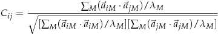

# Scripts for normal mode analysis data visualization

## [01-covar-avrg.cpp](https://github.com/qi-wang-uc/nma-utility/blob/master/01-covar-avrg.cpp)
C++ program to calculate eigenvalue-weighted eigenvectors of selected principal normal modes using the following definition:

## [02-extract-eigenvec.py](https://github.com/qi-wang-uc/nma-utility/blob/master/02-extract-eigenvec.py)
Extract selected eigenvectors from data source.

## [03-gen-gif-movie.tcl](https://github.com/qi-wang-uc/nma-utility/blob/master/03-gen-gif-movie.tcl)
Tcl scripts (run in VMD) to generate gif "movies" of selected normal modes.

## [04-gen-vmd-movie.py](https://github.com/qi-wang-uc/nma-utility/blob/master/04-gen-vmd-movie.py)
Generate vmd-movies (consecutive frames in a PDB file) which can be rendered to a GIF file or just load in VMD for visualization.

## [05-viz-pdb-movie.tcl](https://github.com/qi-wang-uc/nma-utility/blob/master/05-viz-pdb-movie.tcl)
Load and visualize PDB file generated from `gen-vmd-movie.py`

## [06-gen-seg.py](https://github.com/qi-wang-uc/nma-utility/blob/master/06-gen-seg.py)
Generate monomer from a polymer in a PDB file.

## [07-gen-porcupine-data.py](https://github.com/qi-wang-uc/nma-utility/blob/master/07-viz-nma-movie.tcl)
Generate .nmm files for `viz-porcupine-plot.tcl`

## [08-viz-porcupine-plot.tcl](https://github.com/qi-wang-uc/nma-utility/blob/master/08-viz-porcupine-plot.tcl)
Generate "porcupine-plots" (spiky plots) after reading a `.nmm` file.